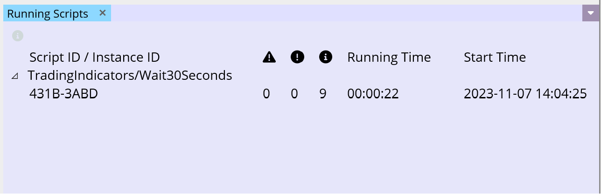

# Whale's Secret UI Design

## Intro
We are building a desktop software called Whale's Secret that runs on Windows and macOS. We are using MAUI framework. The purpose of the software is to help traders on digital asset platforms to improve their work flow and efficiency, no matter if the trader is hobbyist or professional.

### Trading Scripts
The software allows the user to run trading scripts written in C# programming language. A trading script can be a very simple one, such as a single operation execution (create a buy limit order for a specific symbol pair) that finishes very quickly, or it can be very complex script, such as fully automation trading strategy trading simultaneously on multiple exchanges and running for several weeks.

We envision many trading scripts will be pre-created by us to be used by the users who do not wish, or are not capable of, creating their own scripts. But we also envision advanced users to take full advantage of our API integration and implement their own scripts.

The software operates with a list of installed scripts. These scripts can be started by the user. To start a script instance, the user must provide input parameters, different for each script. For example, if the script is a simple script designed only to allow creating a limit buy order, the user would still need to provide information about which exchange platform should be used to place the order on, which symbol pair is to be traded, and what is the limit price of the order and amount to purchase. Once the script is started, a new script instance is created and the script is running.

### Dashboard Screen
When the application is started, there are some initial screens that won't be discussed at this moment. Sooner or later the user ends up on the main screen, which we call the dashboard. The dashboard looks a little bit like a modern browser window with workspace tabs. Each workspace tab has its internal structure that can be customized by the user. A basic element in this internal structure is called a tool pane.

To give you a visual idea, here is an old screenshot of the dashboard, from when we did not have any tool panes implemented:

You can see there are 3 workspaces and many tool panes without content. What we will ask you to do in this test task is related to a simple tool pane called "Running Scripts".

## Task - Running Scripts Tool Pane Design

The test task for this job is to design the "Running Scripts" tool pane. At this moment, it looks like this when a single script instance is running:

On this picture, we can see a sample trading script which is called "TradingIndicators/Wait30Seconds" (more precisely "TradingIndicators" is the name of the package with multiple scripts and the actual script name is just "Wait30Seconds"). The name of the script instance is "431B-3ABD", which is a computer generated unique identifier of the instance.

The instances are grouped under their package-script name and a single instance row can be selected as shown on the next picture:

Selecting a running instance row enables the button at the top of the tool pane, which is called Monitor (on picture the cursor is hovering the button, so the tool tip of the button is visible).

Multiple instances of a same script can be started in parallel (as well as instances of different scripts). When two instances of the same script run in parallel, it looks like this:

On the left side of the the package-script group name there is a little triangle icon, if the user clicks it, the group is collapsed (and when clicked again, it is expanded again):

On this picture, we can see a sample trading script which is called "TradingIndicators/Wait30Seconds" (more precisely "TradingIndicators" is the name of the package with multiple scripts and the actual script name is just "Wait30Seconds"). The name of the script instance is "431B-3ABD", which is a computer generated unique identifier of the instance.

There is some information provided for each running script instance. The name of the instance is in the first column, then there are three columns informing the user about the number of different events that the script raised. The next column is called "Running Time" and it is simply a time that elapsed since the particular instance was started. Last column "Start Time" is the time when it was started.

A script instance can raise events when something notable is happening (for example when an order is placed successfully, or when it is filled, or when an unexpected error occurred). There are 6 severity levels that the script events can be raised on: Trace, Debug, Info, Warn, Error and Fatal. In the Running Scripts tool pane, you can only see three icons, however. This is because we do not consider Trace and Debug events to be interesting enough to make it here. The user is able to see all script instance's events in a dedicated tool, but for this quick summary, we discard Trace and Debug events. The last of the three icon-marked columns thus displays the number of events raised by the script instance on the Info level, the second to last is dedicated for number of the Warn level events, and the first is dedicated to a sum of numbers of events of Error and Fatal events.

### What To Do

Your task is to design the contents of the Running Scripts tool pane. Ignore the tool pane heading ("Running Scripts" label, close button and the down arrow button on the right side in the heading), only focus on the internal content, that means

* At the top there should be area for the action icons.
  * On the screenshots above we've only seen one icon - Monitor icon. When this icon is clicked a dedicated tool pane to the running instance is displayed.
  * Icons that we are currently missing are
    * "Stop Instance" icon - clicking this icon will stop the script instance;
    * "Stop All Script Instances" icon - clicking this will stop all instances of the given trade script (i.e. the entire group);
    * "Stop All Scripts" icon - clicking this will stop all running instances of all scripts (i.e. all groups);
    * "Run Similar" icon - clicking this will open a tool pane to start a similar instance as the currently selected one.
* Hover and pressed effects for all the action icons.
* The running scripts table:
  * Heading row;
  * Package-script row (the group);
  * Instance row with the running data.
  * Icon for the expand and collapse action on the group row.
  * Visual effect of the selected script instance row.

## Appearance

Please design the for the light mode. We also have the dark mode in our app, but for this task, to make it short, please only do light mode. 

We do not have any graphic design finished for any part of the software, except for these two images of the project logo and the application splash screen (the first screen showed to the user when the app is started while loading):

There are mentioned just for inspiration of a color scheme, but you are not required to use it in any way.
